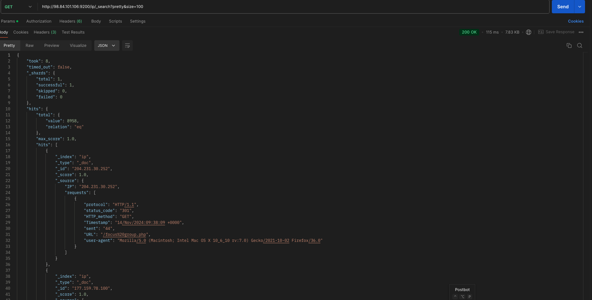

He extendido y creado los playbooks necesarios para lanzar las instancias para ngnix and nifi, hadoop cluster y elasticsearch.
En el caso de la primera, he añadido un ip privado a la configuracion de la instancia ec2 para poder asi referenciarlo en los grupos de seguridad etc.
Tras esto e añadido los pasos necesarios para installar JAVA, añadir el path, descargar nifi, empezar el servicio nifi, actualizar el usuario/contraseña, obtener el token para el rest-api, subir la template, iniciarla e iniciar todos los procesadores. Tambien e añadido los xml necesarios para poder conectar con hdfs a traves de puthdfs, antes de lanzarla verificar el ip privado de la instancia Hadoop-master ya que a veces aws asigna otro y tenemos que acualizar core-site.xml.
En el cluster de hadoop, e utilizado el ip privado de da la instancia nginx_nifi para crear una regla en el security group para permitir el trafico desde la misma.
Y finalmente e creado una instancia para elasticsearch con una version pre-auth para facilitar las cosas y un paso para crear el index ip al que nifi escribe, con reglas en su security group permitiendo el trafico desde nuestro ip publico, tanto ssh como tcp y desde la instancia ngnix_nifi.
Podemos verificar los resultados usando el ui de Hadoop master y podemos hacer request a elasticsearch usando postman o curl para verificar el indice y su contenido.
#### Nifi flows

#### ES query response of index ip

